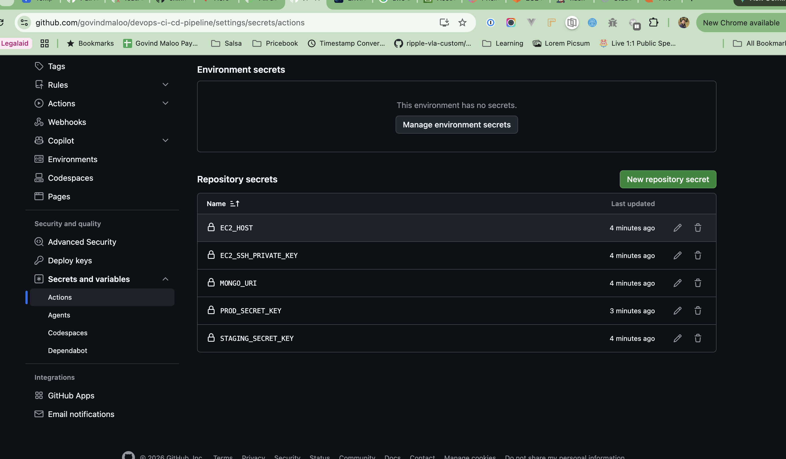
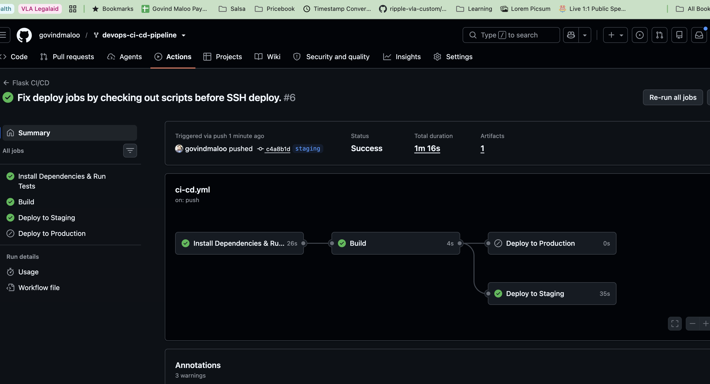
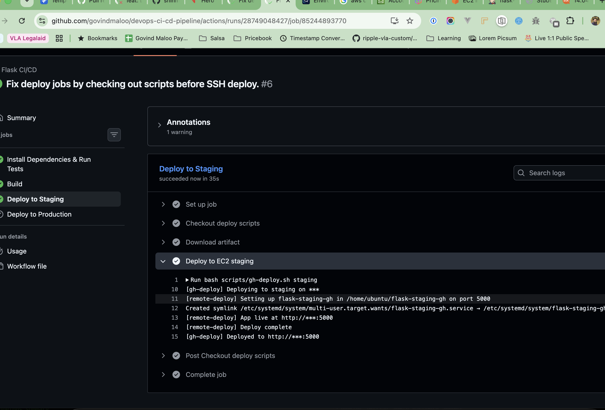
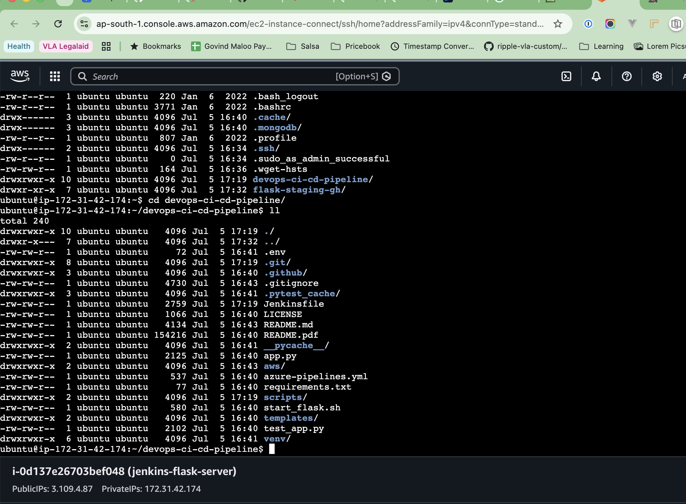

# Assignment 2 — GitHub Actions CI/CD Pipeline for Flask Application

**Repository:** [govindmaloo/devops-ci-cd-pipeline](https://github.com/govindmaloo/devops-ci-cd-pipeline)

**Author:** Govind Maloo

---

## Objective

Implement a CI/CD workflow using GitHub Actions that automates **install**, **test**, **build**, and **deploy** of a Flask student registration application to AWS EC2.

---

## Architecture

```
GitHub Repository
        │
        ├── push main    → Install → Test → Build
        ├── push staging → Install → Test → Build → Deploy Staging (:5000)
        └── release tag  → Install → Test → Build → Deploy Production (:5001)
                │
                ▼ SSH deploy
           EC2 (3.109.4.87)
                ├── flask-staging-gh  → port 5000
                └── flask-production  → port 5001
```

---

## Infrastructure

| Resource | Value |
|----------|-------|
| EC2 Instance | `jenkins-flask-server` (`i-0d137e26703bef048`) |
| Region | `ap-south-1` (Mumbai) |
| Public IP | `3.109.4.87` |
| Staging URL | http://3.109.4.87:5000 |
| Production URL | http://3.109.4.87:5001 |
| Workflow file | [`.github/workflows/ci-cd.yml`](../../.github/workflows/ci-cd.yml) |

---

## Branches

| Branch | Purpose |
|--------|---------|
| `main` | CI + build only (no deploy) |
| `staging` | CI + build + deploy to staging |

Production deploys are triggered by publishing a **GitHub Release** (e.g. tag `v1.0.0`).

---

## Workflow Jobs

| Job | Runs on | Description |
|-----|---------|-------------|
| **Install Dependencies & Run Tests** | All triggers | `pip install` + `pytest` with MongoDB service container |
| **Build** | All triggers | Creates `flask-app.tar.gz` artifact |
| **Deploy to Staging** | `staging` branch only | SSH deploy to EC2 port 5000 |
| **Deploy to Production** | Release published | SSH deploy to EC2 port 5001 |

---

## GitHub Secrets

Configured under **Settings → Secrets and variables → Actions**:

| Secret | Purpose |
|--------|---------|
| `EC2_HOST` | EC2 public IP (`3.109.4.87`) |
| `EC2_SSH_PRIVATE_KEY` | SSH private key for EC2 access |
| `MONGO_URI` | MongoDB URI for deployed app |
| `STAGING_SECRET_KEY` | Flask secret key for staging |
| `PROD_SECRET_KEY` | Flask secret key for production |

---

## Successful Workflow Runs

| Trigger | Run | Result | Link |
|---------|-----|--------|------|
| Push to `main` | #5 | Success | [View run](https://github.com/govindmaloo/devops-ci-cd-pipeline/actions/runs/28749046909) |
| Push to `staging` | #6 | Success | [View run](https://github.com/govindmaloo/devops-ci-cd-pipeline/actions/runs/28749048427) |
| Release `v1.0.0` | #7 | Success | [View run](https://github.com/govindmaloo/devops-ci-cd-pipeline/actions/runs/28749094786) |

---

## Screenshots

### 1. EC2 Deployment Server

AWS EC2 instance `jenkins-flask-server` running in `ap-south-1` with public IP `3.109.4.87`.


---

### 2. GitHub Actions Secrets

Repository secrets configured for EC2 SSH deploy and application environment variables.



---

### 3. Staging Workflow — All Jobs Success

GitHub Actions run for `staging` branch showing all jobs completed:

- Install Dependencies & Run Tests
- Build
- Deploy to Staging



---

### 4. Deploy to Staging — Job Logs

Deploy job showing successful SSH deployment via `gh-deploy.sh` to `/home/ubuntu/flask-staging-gh` on port 5000.



---

### 5. EC2 Project Directory

EC2 Instance Connect terminal showing the cloned `devops-ci-cd-pipeline` repository with `.github/workflows/ci-cd.yml` and deploy scripts.



---

## Key Files

| File | Purpose |
|------|---------|
| `.github/workflows/ci-cd.yml` | GitHub Actions workflow definition |
| `scripts/gh-deploy.sh` | Deploy orchestrator (runs on GitHub runner) |
| `scripts/gh-deploy-remote.sh` | Remote deploy script (runs on EC2) |
| `app.py` | Flask app with `PORT` env support |

---

## Create a Production Release

```bash
git tag v1.0.0
git push origin v1.0.0
gh release create v1.0.0 --title "v1.0.0" --notes "Production release"
```

---

## Deliverables Checklist

- [x] GitHub repository with workflow file
- [x] `main` and `staging` branches
- [x] Install → Test → Build → Deploy staging → Deploy production
- [x] GitHub Secrets configured
- [x] Documentation (this README + root `README.md`)
- [x] Screenshots of workflow execution

---

## Submission

- **Repo URL:** https://github.com/govindmaloo/devops-ci-cd-pipeline
- **Workflow:** https://github.com/govindmaloo/devops-ci-cd-pipeline/actions/workflows/ci-cd.yml
- **Screenshots:** `docs/Assignment-GH/screenshot/`
