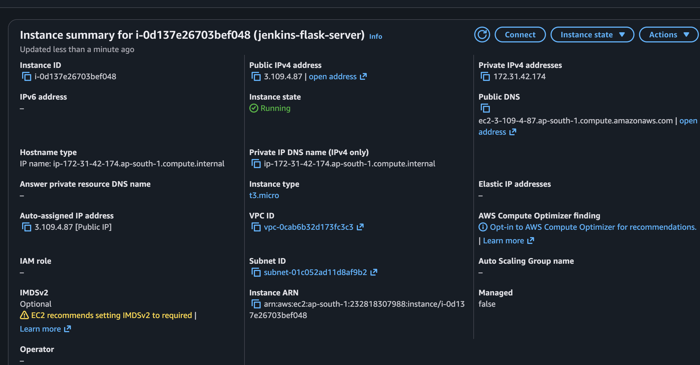
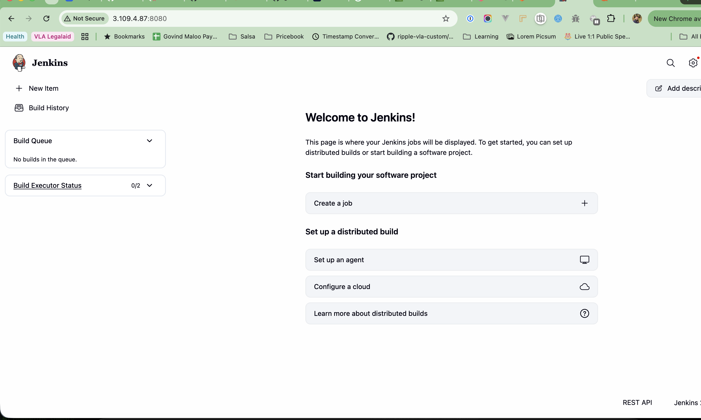
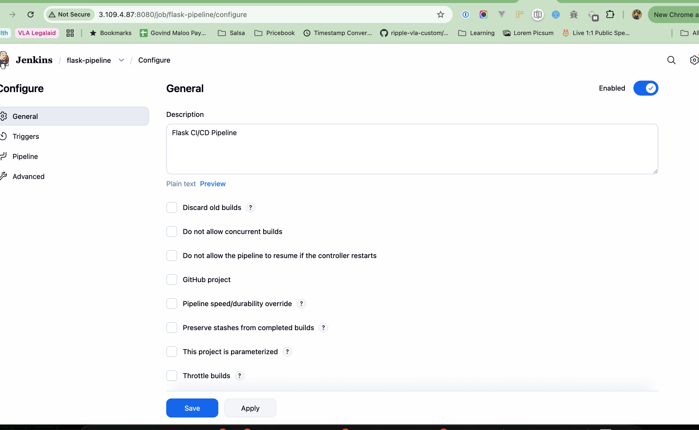
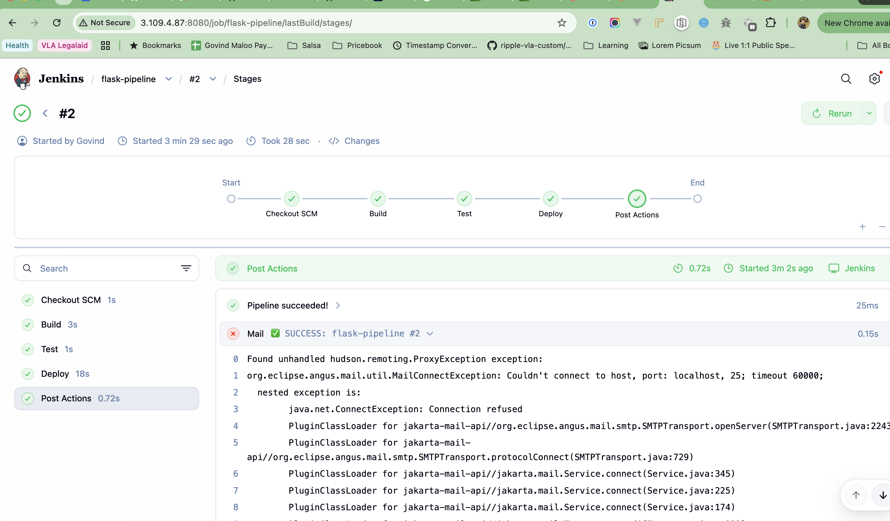
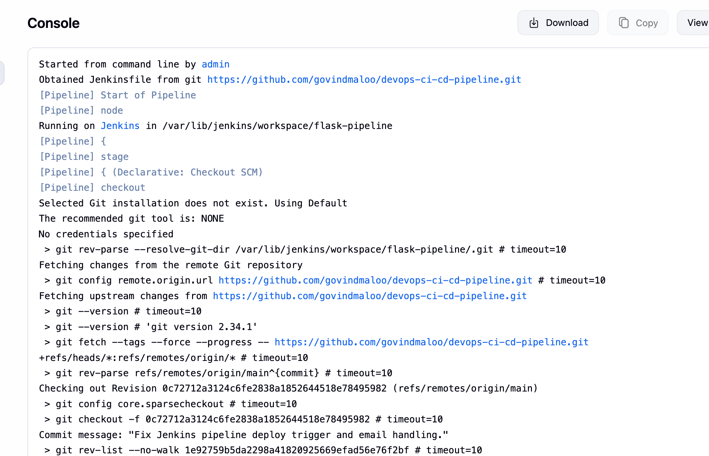
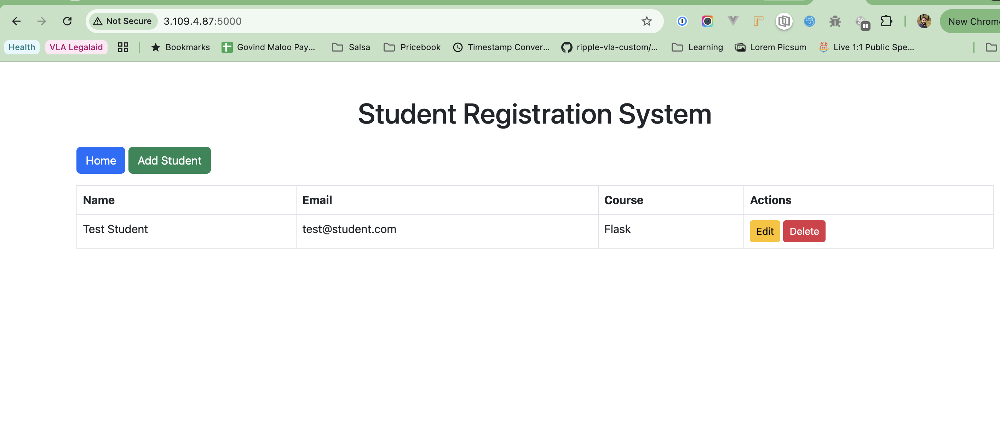

# Assignment 1 — Jenkins CI/CD Pipeline for Flask Application

**Repository:** [govindmaloo/devops-ci-cd-pipeline](https://github.com/govindmaloo/devops-ci-cd-pipeline)

**Author:** Govind Maloo

---

## Objective

Set up a Jenkins pipeline on AWS EC2 that automates **build**, **test**, and **deploy** of a Flask student registration application.

---

## Architecture

```
GitHub (main branch)
        │
        ▼ Poll SCM (every 2 min)
   Jenkins (EC2 :8080)
        │
        ├── Build  → pip install -r requirements.txt
        ├── Test   → pytest test_app.py (MongoDB required)
        └── Deploy → Flask staging app (EC2 :5000)
```

---

## Infrastructure

| Resource | Value |
|----------|-------|
| EC2 Instance | `jenkins-flask-server` (`i-0d137e26703bef048`) |
| Instance Type | `t3.micro` (Ubuntu 22.04) |
| Region | `ap-south-1` (Mumbai) |
| Public IP | `3.109.4.87` |
| Jenkins URL | http://3.109.4.87:8080 |
| Staging App URL | http://3.109.4.87:5000 |
| Pipeline Job | `flask-pipeline` |

---

## Prerequisites

- AWS account with CLI configured
- GitHub fork of the Flask application
- Security group ports: **22** (SSH), **8080** (Jenkins), **5000** (Flask)
- Java 21, Python 3, MongoDB 7 on EC2

### Automated EC2 setup

```bash
./aws/setup.sh
```

### Jenkins pipeline bootstrap (on EC2)

```bash
sudo bash scripts/setup-jenkins-pipeline.sh
```

---

## Pipeline Stages

| Stage | Description |
|-------|-------------|
| **Build** | Creates Python venv and installs dependencies from `requirements.txt` |
| **Test** | Runs `pytest test_app.py` against local MongoDB |
| **Deploy** | Copies app to `/var/lib/jenkins/flask-staging` and restarts `flask-staging` systemd service |

Pipeline definition: [`Jenkinsfile`](../../Jenkinsfile)

---

## Triggers

- **Poll SCM:** `H/2 * * * *` — Jenkins checks the `main` branch on GitHub every 2 minutes
- Deploy stage runs only when the branch contains `main`

---

## Notifications

Email notifications are configured in the Jenkinsfile `post` block for **success** and **failure**.

SMTP must be configured in Jenkins → **Manage Jenkins → System → Extended E-mail Notification** for emails to send. The pipeline continues successfully even if SMTP is not configured.

---

## Access Credentials

| Service | Username | Password |
|---------|----------|----------|
| Jenkins | `admin` | `Jenkins@2026` |

SSH key: `~/Downloads/jenkins-flask-key.pem`

```bash
ssh -i ~/Downloads/jenkins-flask-key.pem ubuntu@3.109.4.87
```

---

## Screenshots

### 1. EC2 Instance Running

AWS EC2 console showing `jenkins-flask-server` in **Running** state with public IP `3.109.4.87`.



---

### 2. Jenkins Dashboard

Jenkins welcome page after installation, accessible at `http://3.109.4.87:8080`.



---

### 3. Pipeline Job Configuration

`flask-pipeline` job general settings — description: *Flask CI/CD Pipeline*.



---

### 4. Pipeline Stages — Build #2 Success

Stage view showing all stages completed successfully:

- Checkout SCM (1s)
- Build (3s)
- Test (1s)
- Deploy (18s)
- Post Actions (0.7s)



---

### 5. Console Output — SCM Checkout

Build console log showing Git checkout from `https://github.com/govindmaloo/devops-ci-cd-pipeline.git` on the `main` branch.



---

### 6. Staging Application Deployed

Flask Student Registration System running on staging at `http://3.109.4.87:5000`.



---

## Key Files

| File | Purpose |
|------|---------|
| `Jenkinsfile` | Declarative pipeline (Build, Test, Deploy) |
| `scripts/deploy-staging.sh` | Staging deployment script |
| `scripts/flask-staging.service` | systemd service for Flask app |
| `scripts/setup-jenkins-pipeline.sh` | Jenkins bootstrap on EC2 |
| `aws/setup.sh` | EC2 provisioning from local machine |

---

## Deliverables Checklist

- [x] Forked GitHub repository with `Jenkinsfile`
- [x] Jenkins installed and configured on EC2
- [x] Pipeline with Build, Test, Deploy stages
- [x] Trigger on `main` branch (Poll SCM)
- [x] Email notification setup in Jenkinsfile
- [x] Documentation (this README + root `README.md`)
- [x] Screenshots of pipeline execution

---

## Submission

- **Repo URL:** https://github.com/govindmaloo/devops-ci-cd-pipeline
- **Screenshots:** `docs/Assignment 1/screenshot/`
